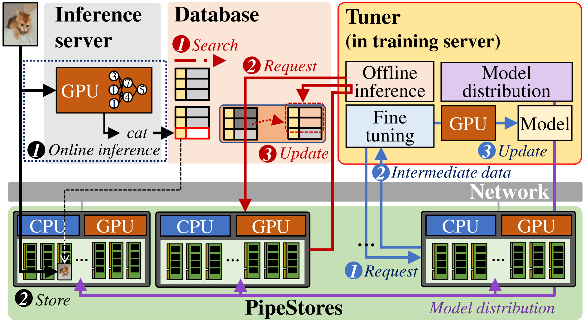

# NDPipe

## What is NDPipe?



NDPipe is a deep learning (DL) system designed to enhance both training and inference performance by embracing the concept of near-data processing (NDP) within storage servers. At its core, NDPipe utilizes an innovative architecture that distributes storage servers equipped with cost-effective commodity GPUs across a data center.

NDPipe is composed of two main elements: PipeStore (storage server equipped with a low-end GPU for near-data training and inference) and Tuner (training server that manages distributed PipeStores)

The original paper that introduced NDPipe is currently in the revision stage of [ACM ASPLOS 2024](https://www.asplos-conference.org/asplos2024/).

The archive snapshot with a detailed screencast used in the paper is available at [](https://zenodo.org/doi/10.5281/zenodo.10796943).

## Prerequisites

NDPipe requires hardware configurations equipped NVIDIA GPU. We detail the AWS instance types or the alternatable NVIDIA GPU-equipped machines that are suitable for NDPipe.

For running the PipeStore component, one or more machines like the following specifications is required:

- Amazon Machine Image (AMI): Deep Learning Base OSS Nvidia Driver GPU AMI (Ubuntu 20.04) version 20240228.
- Instance Type: g4dn.2xlarge
	- 8 vCPUs
	- 32 GiB Memory
	- 1 NVIDIA T4 GPU
	- 125 GiB gp3 Storage

For the Tuner component, a single machine like the following specifications is required:
- Amazon Machine Image (AMI): Deep Learning Base Proprietary Nvidia Driver GPU AMI (Ubuntu 20.04) version 20240201.
- Instance Type: p3.2xlarge
	- 8 vCPUs
	- 61 GiB Memory
	- 1 NVIDIA V100 GPU
	- 125 GiB gp3 Storage

Alternatively, NDPipe can be configured on real machines equipped with CUDA-enabled NVIDIA GPUs for both PipeStore and Tuner.

## Installation & Execution (Fine-tuning)

### PipeStore preparation
1. Clone required repository(NDPipe) into the machine.

```
# PipeStore
~$ git clone https://github.com/dgist-datalab/NDPipe.git
```

2. Generate an SSH key.

```
# PipeStore
~$ ssh-keygen -t rsa
```

3. Display the public SSH key and append it to the Tuner's authorized\_keys.

```
# PipeStore
~$ cat ~/.ssh/id_rsa.pub
```

- On the Tuner machine, run:

	```
	# Tuner
	~$ echo [PublicKeyContent] >> ~/.ssh/authorized_keys
	```

4. Run a Docker container with NVIDIA TensorRT.

```
# PipeStore
~$ docker run --gpus all -it -v ~:/DataLab --name PipeStore nvcr.io/nvidia/tensorrt:20.09-py3
```

5. Set the environment variables for Tuner IP and username (replace placeholders with actual values):

```
# PipeStore
/workspace# export TUNER_IP=[Tuner IP]
/workspace# export TUNER_USERNAME=[Tuner username]
```

6. Add the Tuner IP to known hosts for SSH:

```
# PipeStore
/workspace# ssh-keyscan -H $TUNER_IP >> /DataLab/.ssh/known_hosts
```

7. Update and upgrade the package lists:

```
# PipeStore
/workspace# apt update && apt upgrade
```

8. Update pip and install required Python packages from `requirements.txt`.

```
# PipeStore
/workspace# cd /DataLab/NDPipe/Fine_tuning/PipeStore
.../PipeStore# pip install -r requirements.txt
```

9. repare the dataset directory and download the dataset:

```
# PipeStore
.../PipeStore# mkdir dataset
.../PipeStore# python download_dataset.py
```

10. (optional) If not using a T4 GPU, compile the model specifically for your GPU (e.g., for a different GPU):

```
# PipeStore
trtexec --onnx=resnet50.onnx --workspace=8192 --saveEngine=resnet50.engine --buildOnly --inputIOFormats=fp16:chw --outputIOFormats=fp16:chw --fp16
```

### Tuner Preparation

1. Clone required repository(NDPipe) into the machine.

```
# Tuner
~$ git clone https://github.com/dgist-datalab/NDPipe.git
```

2. Update pip and install required Python packages from `requirements.txt`.

```
# Tuner
~$ cd NDPipe/Fine_tuning/Tuner
.../Tuner$ pip install -r requirements.txt
```

### Running the System (< 2mins to run)

1. On the Tuner, start the server script with optional parameters:

```
# Tuner
.../Tuner$ python3.9 server.py --num_of_run [value] --num_of_client [value] --port [value]
```
- `--num_of_run` or	`-r`: Sets the pipelining strength. Default is 1.
- `--num_of_client` or `-n`: The number of PipeStores. Default is 1.
- `--port` or `-p`: Socket connection port. Default is 25258.

2. Simultaneously execute the main script on each PipeStore server (specifying the port if needed).

```
# PipeStore
.../PipeStore# python main.py [port]
```
- The script uses a command-line argument for the port if provided; otherwise, it defaults to 25258.

3. Review the inference results. In this test, we provide two pieces of information: the elapsed time for the feature extraction time/throughput (executed in PipeStore) and the overall fine-tuning time.

```
# In AWS setting
Feature extraction time (sec):               31.360074814000654
Feature extraction throughput (image/sec):   1913.2607417509444
Overall fine-tuning time (sec):              75.19124622900017
```

## Installation & Execution (Offline Inference)

For offline inference evaluation, we provide a simple test code. This code can be executed on the PipeStore side.

### PipeStore Preparation

The prerequisites for offline inference are almost identical to those required for fine-tuning.

1. Follow steps 1-8 of the fine-tuning guide (Only PipeStore setup is needed).

2. Install the deflate module by following the instructions below:
```
/workspace# cd /DataLab/NDPipe/Offline_inference
.../Offline_inference# pip3 install deflate
```

3. Download the dataset file and unzip it. This dataset is based on CIFAR-100 and contains 10,000 compressed binaries of preprocessed images.
```
../Offline_inference# wget https://zenodo.org/record/10409599/files/test-fio-small
../Offline_inference# sha256sum test-fio-small
2171a00ff770a7279383522cb5961b55d1976feeda79fea4607d1146e4fa1c69
../Offline_inference# unzip inference_dataset.zip 
```

4. Compile the model specifically for your GPU
```
trtexec --onnx=resnet50.onnx --workspace=8192 --saveEngine=resnet50.engine --buildOnly --inputIOFormats=fp16:chw --outputIOFormats=fp16:chw --fp16
```


### Running the System (Takes < 1 min to run)

1. Execute the following command: the first argument specifies the path to the model's engine, and the second argument specifies the dataset path.
```
python3 inference_test.py resnet50.engine image/
```

2. Review the inference results. In this test, we provide two pieces of information: the elapsed time for inference and the inference throughput.
```
[NDPipe] inference time: 12.25sec
[NDPipe] inference throughput : 863.53IPS
```
